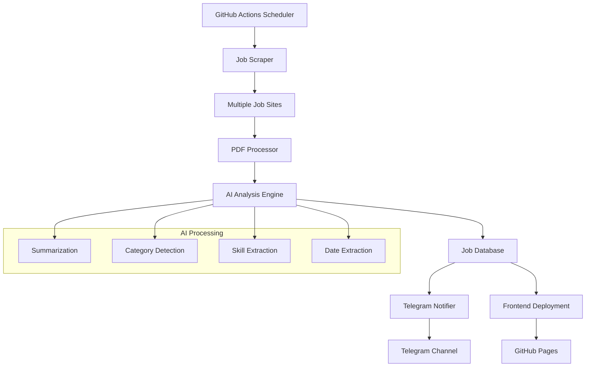

# SarkariSarthi 2.0 🚀

**Smart AI-Powered Indian Sarkari Job Portal**

[](https://github.com/username/SarkariSarthi_2.0/actions)
[](https://opensource.org/licenses/MIT)
[](https://www.python.org/downloads/)
[](https://t.me/sarkarisarthi)

SarkariSarthi 2.0 is an intelligent, AI-powered job portal specifically designed for Indian government job seekers. It automatically scrapes multiple sarkari job websites, processes job descriptions using advanced AI, and provides instant notifications through Telegram.

## ✨ Features

### 🤖 AI-Powered Intelligence
- **Smart Job Summarization**: Automatically summarizes lengthy job descriptions using HuggingFace/OpenAI models
- **Intelligent Category Detection**: Auto-categorizes jobs (Banking, SSC, Railway, Police, Defence, Teaching, UPSC, etc.)
- **Skill Extraction**: Identifies trending skills and requirements using NER (Named Entity Recognition)
- **Date & Link Extraction**: Automatically extracts important dates and application links

### 🔍 Advanced Job Scraping
- **Multi-Source Scraping**: Scrapes 10+ popular Indian job sites including:
  - FreeJobAlert.com
  - SarkariNaukri.com
  - NCS.gov.in
  - MySarkariNaukri.com
  - BharatSarkariJob.com
  - AllGovernmentJobs.in
  - And more...
- **PDF Processing**: Downloads and extracts text from PDF notifications using PyMuPDF and pdfplumber
- **Deep Crawling**: Follows job links to extract detailed information
- **Duplicate Detection**: Prevents duplicate job entries

### 📱 Modern Frontend
- **Glassmorphism Design**: Beautiful, modern UI with glass-like effects
- **Dark Mode Support**: Toggle between light and dark themes
- **Responsive Design**: Works perfectly on desktop, tablet, and mobile
- **Advanced Search & Filters**: Smart search with category and sorting options
- **Job Detail Modals**: Detailed job information in elegant popups
- **Animated Counters**: Dynamic statistics display

### 🔔 Instant Notifications
- **Telegram Integration**: Real-time job alerts sent to Telegram groups and personal chats
- **Formatted Messages**: Rich, well-formatted job notifications with all essential details
- **Smart Filtering**: Only sends notifications for new, relevant jobs

### ⚙️ Automation & Deployment
- **GitHub Actions**: Fully automated daily job fetching and deployment
- **Auto-Deployment**: Automatically deploys to GitHub Pages
- **Health Monitoring**: Website health checks and failure notifications
- **Logging**: Comprehensive logging for debugging and monitoring

## 🏗️ Architecture



## 🚀 Quick Start

### Prerequisites
- Python 3.11+
- Git
- GitHub account (for deployment)
- Telegram Bot Token (for notifications)

### Installation

1. **Clone the repository**
   ```bash
   git clone https://github.com/username/SarkariSarthi_2.0.git
   cd SarkariSarthi_2.0
   ```

2. **Install dependencies**
   ```bash
   pip install -r requirements.txt
   ```

3. **Configure Telegram (Optional)**
   - Update `telegram_notifier.py` with your bot token and chat IDs
   - The default configuration uses the provided bot token

4. **Run the job scraper**
   ```bash
   python fetch_jobs.py
   ```

5. **Start local development server**
   ```bash
   # For simple HTTP server
   python -m http.server 8000
   
   # Or use any web server of your choice
   ```

6. **Open in browser**
   ```
   http://localhost:8000
   ```

## 📁 Project Structure

```
SarkariSarthi_2.0/
├── 📄 fetch_jobs.py           # Main job scraper with AI processing
├── 📄 telegram_notifier.py    # Telegram notification system
├── 📄 index.html             # Frontend HTML
├── 📄 style.css              # Glassmorphism CSS styles
├── 📄 script.js              # Frontend JavaScript
├── 📄 requirements.txt       # Python dependencies
├── 📄 README.md              # This file
├── 📁 jobs/                  # Job data storage
│   ├── 📄 job_manifest.json  # Job metadata
│   └── 📄 *.json            # Individual job files
├── 📁 .github/
│   └── 📁 workflows/
│       └── 📄 fetch.yml      # GitHub Actions workflow
├── 🖼️ hero-bg.jpg            # Hero background image
├── 🖼️ job-search-icon.png    # Search icon
├── 🖼️ notification-icon.png  # Notification icon
└── 🖼️ ai-powered-icon.png    # AI icon
```

## 🔧 Configuration

### Environment Variables
Set these in your GitHub repository secrets for production:

```bash
TELEGRAM_BOT_TOKEN=your_bot_token_here
TELEGRAM_GROUP_CHAT_ID=your_group_chat_id
PERSONAL_TELEGRAM_CHAT_ID=your_personal_chat_id  # Optional
```

### Customization
- **Job Sources**: Add more job sites in `fetch_jobs.py`
- **AI Models**: Configure different models in the AI processing functions
- **Styling**: Modify CSS variables in `style.css` for custom themes
- **Telegram**: Update bot token and chat IDs in `telegram_notifier.py`

## 🤖 AI Usage

SarkariSarthi 2.0 leverages multiple AI technologies:

### 1. **Text Summarization**
- Uses HuggingFace transformers for job description summarization
- Fallback to OpenAI API for enhanced summaries
- Configurable summary length and quality

### 2. **Named Entity Recognition (NER)**
- Extracts important dates, deadlines, and application links
- Identifies skills and qualifications
- Recognizes organization names and locations

### 3. **Text Classification**
- Automatically categorizes jobs into predefined categories
- Uses keyword matching with ML model fallback
- Continuously improves with more data

### 4. **PDF Processing**
- Extracts text from PDF notifications using PyMuPDF
- Fallback to pdfplumber for complex PDFs
- Processes multi-page documents efficiently

## 📊 Data Flow

1. **Scheduled Execution**: GitHub Actions triggers daily at 5 AM IST
2. **Web Scraping**: Scrapes multiple job sites for new postings
3. **PDF Processing**: Downloads and extracts text from PDF links
4. **AI Analysis**: Processes content through AI models
5. **Data Storage**: Saves jobs as JSON files with metadata
6. **Notification**: Sends new job alerts via Telegram
7. **Deployment**: Updates website with latest jobs
8. **Health Check**: Verifies website accessibility

## 🔄 Deployment

### GitHub Pages (Automatic)
The project automatically deploys to GitHub Pages via GitHub Actions:

1. **Fork/Clone** this repository
2. **Enable GitHub Pages** in repository settings
3. **Configure secrets** for Telegram notifications
4. **Push changes** to trigger deployment

### Manual Deployment
For other hosting platforms:

```bash
# Build static files (if needed)
# Copy these files to your web server:
- index.html
- style.css
- script.js
- jobs/
- *.png, *.jpg (images)
```

## 🧪 Testing

### Running Tests
```bash
# Install test dependencies
pip install pytest pytest-cov

# Run tests
pytest tests/ -v

# Run with coverage
pytest tests/ --cov=. --cov-report=html
```

### Test Structure
```
tests/
├── test_fetch_jobs.py      # Job scraper tests
├── test_telegram.py        # Telegram notification tests
├── test_ai_processing.py   # AI functionality tests
└── test_frontend.py        # Frontend functionality tests
```

## 📈 Monitoring & Analytics

### Logs
- **Scraper Logs**: Detailed logs of job fetching process
- **Error Tracking**: Comprehensive error logging and reporting
- **Performance Metrics**: Scraping time and success rates

### Telegram Notifications
- **Success Notifications**: Deployment and update confirmations
- **Failure Alerts**: Immediate notification of any failures
- **Health Checks**: Regular website accessibility checks

## 🤝 Contributing

We welcome contributions! Please see our [Contributing Guidelines](CONTRIBUTING.md) for details.

### Development Setup
1. Fork the repository
2. Create a feature branch: `git checkout -b feature-name`
3. Make your changes and test thoroughly
4. Commit with descriptive messages
5. Push to your fork and submit a pull request

### Code Style
- Follow PEP 8 for Python code
- Use meaningful variable and function names
- Add comments for complex logic
- Write tests for new features

## 📝 License

This project is licensed under the MIT License - see the [LICENSE](LICENSE) file for details.

## 🙏 Acknowledgments

- **HuggingFace**: For providing excellent NLP models
- **OpenAI**: For advanced AI capabilities
- **Telegram**: For reliable messaging platform
- **GitHub**: For hosting and automation
- **Job Portals**: For providing valuable job data

## 📞 Support

- **Telegram Channel**: [Join SarkariSarthi](https://t.me/sarkarisarthi)
- **Issues**: [GitHub Issues](https://github.com/username/SarkariSarthi_2.0/issues)
- **Discussions**: [GitHub Discussions](https://github.com/username/SarkariSarthi_2.0/discussions)

## 🔮 Roadmap

- [ ] **Mobile App**: React Native mobile application
- [ ] **Advanced AI**: GPT-4 integration for better analysis
- [ ] **User Accounts**: Personalized job recommendations
- [ ] **Email Notifications**: Alternative to Telegram
- [ ] **Job Application Tracking**: Track application status
- [ ] **Salary Insights**: AI-powered salary predictions
- [ ] **Interview Preparation**: AI-generated interview questions

---

**Made with ❤️ for Indian job seekers**

*SarkariSarthi 2.0 - Your intelligent companion for government job opportunities*

